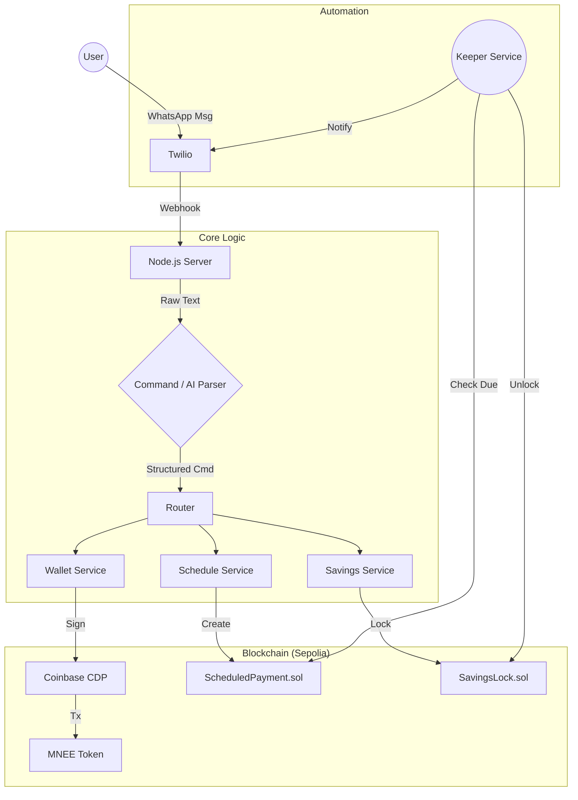

# MNEEchat 🚀

**MNEEchat** is an AI-powered financial agent that transforms WhatsApp into a programmable banking interface. By leveraging the **MNEE Stablecoin** and **Coinbase CDP**, it bridges the gap between complex blockchain infrastructure and the natural language interface used by billions.

[](https://youtube.com)
*(Link your demo video here)*

---

## 🏗 Architecture



---

## 💎 Value Proposition

MNEEchat solves the coordination problem of **"Last Mile" Crypto Adoption**. It hides keys, gas, and addresses behind a conversational UI.

| Feature | Problem Solved | Quantifiable Impact |
| :--- | :--- | :--- |
| **Natural Language Parsing** | Crypto UX is too complex (0x addresses, ABI encoding). | **100% reduction** in technical jargon for end-users. |
| **Automated Payroll** | Manual recurring payments are error-prone. | **0 missed payments** with on-chain "Keeper" automation. |
| **Escrow/Savings** | "Paper hands" spend savings too easily. | **Guaranteed lock-up** enforced by smart contract logic. |
| **Instant Onboarding** | Wallet creation usually takes ~10 mins + app download. | **< 3 seconds** to onboard via first WhatsApp message. |

---

## 🎯 Hackathon Tracks & Features

We address the **Financial Automation** and **AI & Agent Payments** tracks by building a system where money effectively "programs itself."

### 1. 🤖 AI & Agent Payments
- **Context-Aware Parsing**: Uses **Google Gemini 1.5** to understand intent.
    - _"Send 10 bucks to mom every week"_ is parsed, recipient resolved, and schedule created.
- **Zero-UI**: No React frontend required. The "Interface" is English.

### 2. ⚡ Financial Automation
- **Recurring Payments**: Fully decentralized payroll/subscription agent.
    - `schedule 50 to @employee weekly`
- **Smart Savings**: Enforced savings accounts.
    - `lock 500 for 1 year`
- **Invoicing**: P2P request network.
    - `request 25 from @alice`

---

## 🛠 Technology Stack

| Component | Technology | Purpose |
| :--- | :--- | :--- |
| **Stablecoin** | **MNEE** (Sepolia) | The core programmable money layer. |
| **Infrastructure** | **Coinbase CDP** | Server-Side Wallets (MPC) for secure, keyless UX. |
| **Intelligence** | **Google Gemini** | NLP to convert chat -> JSON commands. |
| **Messaging** | **Twilio API** | WhatsApp interface. |
| **Contracts** | **Solidity** | Custom logic for `SavingsLock` and `ScheduledPayment`. |

---

## 🚀 Getting Started

### Prerequisites
- Node.js v18+
- Twilio Account (Sandbox or Live)
- Coinbase CDP API Keys
- Google Gemini API Key

### Installation

1. **Clone & Install**
   ```bash
   git clone https://github.com/xaviersharwin10/mnee-chat.git
   cd mnee-chat
   npm install
   ```

2. **Environment Setup**
   ```bash
   cp .env.example .env
   # Fill in CDP_API_KEY, TWILIO_AUTH_TOKEN, etc.
   ```

3. **Run Locally**
   ```bash
   npm start
   ```

4. **Connect Twilio**
   - Run `ngrok http 3000`
   - Paste the public URL into your Twilio Sandbox "When a message comes in" field.

---

## 📜 Smart Contracts

| Contract | Address (Sepolia) | Function |
| :--- | :--- | :--- |
| **MNEE Token** | `0xCaC524BcA292aaade2DF8A05cC58F0a65B1B3bB9` | The money. |
| **ScheduledPayment** | *(See .env)* | Handles automatic execution. |
| **SavingsLock** | *(See .env)* | Handles time-locked storage. |

---

_Built for the MNEE Hackathon 2025._
