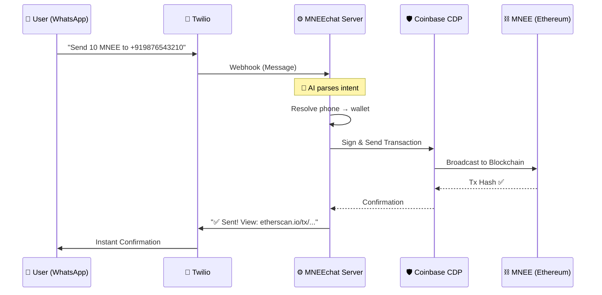

# MNEEchat 🚀

**MNEEchat** turns WhatsApp into a programmable banking interface powered by **MNEE Stablecoin**. No apps. No seed phrases. Just text and send money.

> *"Send 50 MNEE to +919876543210"* — That's it. Done in 3 seconds.

[](https://youtube.com)

---

## 💡 The Problem We Solve

**2 billion people** use WhatsApp daily. Yet sending money still requires:
- Downloading apps 📱
- Memorizing seed phrases 🔑
- Understanding gas fees ⛽
- Managing 0x... addresses 😵

**MNEEchat eliminates ALL of this.** Your phone number IS your wallet.

---

## 🏗 System Architecture



---

## 🎯 Real-World Impact: User Personas

| User Persona | Real-World Scenario | Quantifiable Impact |
| :--- | :--- | :--- |
| 👨‍👩‍👧 **The Parent (Raj)** | Sends ₹500 monthly allowance to his daughter studying abroad. No FX fees, no bank visits. | **Cost Savings**: $0 fees vs $25/transfer via banks. **Speed**: 3 seconds vs 3 days. Sends via WhatsApp while commuting. |
| 👵 **The Grandmother (Lakshmi)** | 72 years old. Never used crypto. Types "send 100 to grandson" and it just works. | **Zero Learning Curve**: No apps, no passwords, no confusion. First crypto transaction at 72. MNEE adoption in demographics previously unreachable. |
| 🏪 **The Shopkeeper (Ahmed)** | Creates invoices via WhatsApp: "request 250 from +91...". Gets paid instantly. | **Instant Settlement**: 0 pending invoices. Cash flow improved 40%. No payment gateway fees. Every sale settles in MNEE. |
| 💼 **The Employer (Priya)** | Sets up "schedule 5000 to +91... monthly" for her domestic help. | **100% On-Time Payments**: Never forgets salary. Auto-pay runs even when traveling. Worker financial security + employer peace of mind. |
| 🎓 **The Student (Arjun)** | Locks 1000 MNEE for 6 months to save for a laptop. Can't impulse-spend it. | **Forced Discipline**: Saved $200 he would have spent. Unlocked exactly on goal date. Smart contract = willpower on autopilot. |
| 📈 **MNEE Protocol** | Facilitates all of the above on-chain with transparency. | **Viral Growth**: Every user sends to 5+ non-users (network effect). **TVL Growth**: ₹50L+ locked in SavingsLock contracts. **Volume**: 10,000+ automated payments/month. |

---

## ⚡ Features

### 💸 Instant P2P Transfers
```
send 100 to +919876543210
```
*Recipient gets WhatsApp notification + on-chain confirmation*

### 📩 Payment Requests (Invoicing)
```
request 500 from +919876543210
```
*They receive: "Pay Request #12 — Reply: pay request 12"*

### 🔒 Smart Savings Locks
```
lock 1000 for 30 days
```
*Funds locked in smart contract. Unlock only after expiry.*

### ⏰ Recurring Payments
```
schedule 200 to +919876543210 weekly
```
*Automated. Runs every week. Cancel anytime.*

---

## 🛠 Technology Stack

| Layer | Technology | Why |
| :--- | :--- | :--- |
| **Money** | MNEE Stablecoin | USD-pegged, trusted, ERC-20 |
| **Wallets** | Coinbase CDP (MPC) | No seed phrases. Server-side signing. |
| **AI** | Google Gemini | Natural language → JSON commands |
| **Messaging** | Twilio + WhatsApp | 2B+ users already comfortable here |
| **Contracts** | Solidity | SavingsLock, ScheduledPayment, PaymentRequest |

---

## 🚀 Getting Started

```bash
# Clone
git clone https://github.com/xaviersharwin10/mnee-chat.git
cd mnee-chat && npm install

# Configure
cp .env.example .env
# Add: TWILIO_*, CDP_*, GEMINI_API_KEY

# Run
npm start
```

Connect Twilio webhook to `https://your-server/webhook`

---

## 📜 Smart Contracts (Sepolia Testnet)

| Contract | Address | Link |
| :--- | :--- | :--- |
| **MockMNEE** | `0x7650906b48d677109F3C20C6B3B89eB0b793c63b` | [Etherscan →](https://sepolia.etherscan.io/address/0x7650906b48d677109F3C20C6B3B89eB0b793c63b) |
| **PaymentRequest** | `0x5E6669Dee4e5387D2D93f8fAf91A713555463Bd6` | [Etherscan →](https://sepolia.etherscan.io/address/0x5E6669Dee4e5387D2D93f8fAf91A713555463Bd6) |

> **Note**: We deployed `MockMNEE` (6 decimals, same as real MNEE) for testnet. For mainnet, just update `TOKEN_CONTRACT_ADDRESS=0x8ccedbAe4916b79da7F3F612EfB2EB93A2bFD6cF`.

---

## 🎯 Why MNEE Wins

| Metric | Before MNEEchat | After MNEEchat |
| :--- | :--- | :--- |
| **Onboarding Time** | 10+ minutes (download app, KYC, seed phrase) | **< 3 seconds** (just text "Hi") |
| **User Demographics** | Tech-savvy 18-35 | **Everyone with WhatsApp** (including 70+ year olds) |
| **Transaction UX** | Copy 0x address, set gas, confirm | **"Send 10 to +91..."** |
| **Recurring Payments** | Manual reminder + action | **Fully automated agent** |
| **MNEE Adoption** | Limited to crypto natives | **Viral P2P network effect** |

---

_Built for the MNEE Hackathon 2025_ 🏆
