# MNEEchat 🚀

**MNEEchat** is an AI-powered financial agent that transforms WhatsApp into a programmable banking interface. By leveraging the **MNEE Stablecoin** and **Coinbase CDP**, it bridges the gap between complex blockchain infrastructure and the natural language interface used by billions.

[](https://youtube.com)
*(Link your demo video here)*

---

## 🏗 Architecture

## 🏗 System Architecture

The following sequence demonstrates how a single natural language message translates into verified on-chain value movement, powered by **Coinbase CDP**.

```mermaid
sequenceDiagram
    participant User as 👤 User (WhatsApp)
    participant Twilio as 💬 Twilio
    participant Server as ⚙️ MNEEchat Server
    participant CDP as 🛡️ Coinbase CDP (MPC)
    participant Chain as ⛓️ MNEE (Sepolia)

    User->>Twilio: "Send 10 MNEE to @Alice"
    Twilio->>Server: Webhook (Text)
    
    rect rgb(30, 30, 30)
        Note over Server: 🧠 NLP Processing
        Server->>Server: Parse Intent & Resolve @Alice
    end
    
    Server->>CDP: Request Transaction
    Note right of Server: "Sign transfer(Alice, 10) with Sender's MPC Key"
    
    CDP->>Chain: Broadcast Signed Tx
    Chain-->>CDP: Tx Hash (0x123...)
    CDP->>Server: Success Response
    
    Server->>Twilio: "✅ Sent! Hash: 0x123..."
    Twilio->>User: Confirmation Message
```



---

## � Driving MNEE Adoption: The "Frictionless" Thesis

MNEEchat is built on a single core thesis: **Adoption follows Convenience.**

Current crypto adoption is stalled by "Wallet Friction": Seed phrases, gas fees, and complex UIs. MNEEchat removes these barriers completely, directly impacting MNEE's velocity and TVL.

| Adoption Barrier | The MNEEchat Solution | Benefit to MNEE Protocol |
| :--- | :--- | :--- |
| **Onboarding Latency** | **Zero-Step Onboarding**: Accounts are created instantly upon first message via Coinbase CDP. | **Higher User Velocity**: Users can receive MNEE before they even know what a wallet is. |
| **UX Complexity** | **Natural Language**: "Send 10" replaces `transfer(0x...)`. | **Mass Market Access**: Unlocks demographics (older/non-tech) who use WhatsApp but not Metamask. |
| **Merchant Resistance** | **Instant Invoices**: "Request 50 from Client" creates a payable link/action. | **Commercial Utility**: Transforms MNEE from "speculative asset" to "business tool". |
| **Stagnant TVL** | **Programmable Savings**: "Lock MNEE" prevents selling/spending. | **Sticky Liquidity**: Encourages holding MNEE for long-term goals (savings/escrow). |

---

## 🎯 Hackathon Tracks & Features

We address the **Financial Automation** and **AI & Agent Payments** tracks by building a system where money effectively "programs itself."

### 1. 🤖 AI & Agent Payments
- **Context-Aware Parsing**: Uses **Google Gemini 1.5** to understand intent.
    - _"Send 10 bucks to mom every week"_ is parsed, recipient resolved, and schedule created.
- **Zero-UI**: No React frontend required. The "Interface" is English.

### 2. ⚡ Financial Automation
- **Recurring Payments**: Fully decentralized payroll/subscription agent.
    - `schedule 50 to @employee weekly`
- **Smart Savings**: Enforced savings accounts.
    - `lock 500 for 1 year`
- **Invoicing**: P2P request network.
    - `request 25 from @alice`

---

## 🛠 Technology Stack

| Component | Technology | Purpose |
| :--- | :--- | :--- |
| **Stablecoin** | **MNEE** (Sepolia) | The core programmable money layer. |
| **Infrastructure** | **Coinbase CDP** | Server-Side Wallets (MPC) for secure, keyless UX. |
| **Intelligence** | **Google Gemini** | NLP to convert chat -> JSON commands. |
| **Messaging** | **Twilio API** | WhatsApp interface. |
| **Contracts** | **Solidity** | Custom logic for `SavingsLock` and `ScheduledPayment`. |

---

## 🚀 Getting Started

### Prerequisites
- Node.js v18+
- Twilio Account (Sandbox or Live)
- Coinbase CDP API Keys
- Google Gemini API Key

### Installation

1. **Clone & Install**
   ```bash
   git clone https://github.com/xaviersharwin10/mnee-chat.git
   cd mnee-chat
   npm install
   ```

2. **Environment Setup**
   ```bash
   cp .env.example .env
   # Fill in CDP_API_KEY, TWILIO_AUTH_TOKEN, etc.
   ```

3. **Run Locally**
   ```bash
   npm start
   ```

4. **Connect Twilio**
   - Run `ngrok http 3000`
   - Paste the public URL into your Twilio Sandbox "When a message comes in" field.

---

## 📜 Smart Contracts

| Contract | Address (Sepolia) | Function |
| :--- | :--- | :--- |
| **MNEE Token** | `0xCaC524BcA292aaade2DF8A05cC58F0a65B1B3bB9` | The money. |
| **ScheduledPayment** | *(See .env)* | Handles automatic execution. |
| **SavingsLock** | *(See .env)* | Handles time-locked storage. |

---

_Built for the MNEE Hackathon 2025._
