# MNEEchat 🚀

**WhatsApp Payments Powered by MNEE** — *Send stablecoins as easily as a text message.*

MNEEchat turns WhatsApp into a programmable banking interface powered by MNEE. It removes all crypto friction (seed phrases, gas fees, addresses) by using Coinbase CDP for server-side MPC wallets and Google Gemini to parse natural language commands (e.g., "send 50 to mom"). Features include instant P2P transfers, payment requests, savings time-locks, and automated recurring payments—all via WhatsApp text or the web portal.

[](https://opensource.org/licenses/MIT)

---

## 🏆 Usage Instructions (Start Here)

Follow these steps to fully test the application on **Sepolia Testnet** (using MockMNEE):

### Step 1: Join the Bot 📱
1. Click to open in WhatsApp: **[wa.me/14155238886](https://wa.me/14155238886?text=join%20depth-army)**
2. **IMPORTANT**: You MUST send the pre-filled message `join depth-army` to activate the Sandbox.
3. Wait for the confirmation: *"You are all set!"*

### Step 2: Get Test Tokens (Faucet) 🚰
You need **MockMNEE** tokens to use the bot.
*   **Option A (Easiest)**: Text `faucet` to the bot. It will send 100 MNEE to your derived wallet.
*   **Option B (Web)**: Go to **[mnee-chat.vercel.app](https://mnee-chat.vercel.app)**:
    *   **To Wallet**: Connect wallet -> Click `🚰 Get 100 Test MNEE (to Wallet)`
    *   **To Phone**: Enter number -> Click `🚰 Get Test MNEE to this Phone`

### Step 3: Test Core Features ⚡
Try these commands in WhatsApp:

1.  **Check Balance**: `balance` (Should show 100 MNEE)
2.  **Send Money**: `send 10 to +919876543210` (Or use a friend's number)
3.  **Lock Savings**: `lock 50 for 1 minute` (Wait 1 min, then `withdraw lock <id>`)
4.  **Recurring Pay**: `schedule 1 to +919876543210 every 2 minutes`

### Step 4: Web Portal (Gas & MNEE) 🌐
Use the **[Web Portal](https://mnee-chat.vercel.app)** to interact from a browser:
1.  Connect your MetaMask (Sepolia).
2.  Enter any phone number.
3.  **Send Gas (ETH)**: Select "Gas (ETH)" to send Sepolia ETH to a phone's smart wallet so they can pay gas fees!
4.  **Send MNEE**: Send MockMNEE directly from your browser wallet to a phone number.

---

## ⚙️ Mainnet Configuration (For Production)

To run MNEEchat with **Real MNEE** on Ethereum Mainnet:

1.  **Update `.env`**:
    ```bash
    # Switch RPC to Mainnet
    ETHEREUM_RPC_URL=https://mainnet.infura.io/v3/YOUR_KEY
    
    # Set Real MNEE Contract Address
    TOKEN_CONTRACT_ADDRESS=0x8ccedbAe4916b79da7F3F612EfB2EB93A2bFD6cF
    
    # Update Coinbase CDP Network
    CDP_NETWORK_ID=ethereum-mainnet
    ```
2.  **Fund System Wallet**: Ensure your `PRIVATE_KEY` wallet has real ETH for gas sponsorship (if using sponsor mode).
3.  **Deploy**: Run `npm start`. The bot will now process real USD stablecoin transactions!

---

## 💡 The Problem We Solve

**2 billion people** use WhatsApp daily. Yet sending crypto still requires:
- Downloading apps 📱
- Memorizing seed phrases 🔑
- Understanding gas fees ⛽
- Managing 0x... addresses 😵

**MNEEchat eliminates ALL of this.** Your phone number IS your wallet.

---

## 🎯 Value Proposition: How MNEEchat Drives MNEE Adoption

| User Persona | Real-World Scenario | Quantifiable Impact on MNEE |
| :--- | :--- | :--- |
| 👨‍👩‍👧 **The Parent (Raj)** | Sends monthly allowance to his daughter abroad. No FX fees, no bank visits—just texts "send 5000 to +1..." | **Network Growth**: Every cross-border send onboards a new MNEE user. 1 user → 5 recipients → viral adoption loop. |
| 👵 **The Grandmother (Lakshmi)** | 72 years old. Never used crypto. Types "send 100 to grandson" and it works. | **Demographic Expansion**: MNEE reaches 60+ age group for the first time. Previously impossible market = unlocked. |
| 🏪 **The Shopkeeper (Ahmed)** | Creates invoices via WhatsApp. "request 250 from +91...". Gets paid instantly. | **Daily Volume**: Every merchant becomes a MNEE payment terminal. 100 shops × 10 tx/day = 1000 daily MNEE transactions. |
| 💼 **The Employer (Priya)** | Sets up "schedule 5000 to +91... monthly" for domestic help salary. | **Recurring TVL**: Automated payments = predictable MNEE velocity. Locked allowances = guaranteed monthly on-chain activity. |
| 🎓 **The Student (Arjun)** | Locks 1000 MNEE for 6 months to save for a laptop. | **TVL Growth**: Smart contract locks = MNEE held off exchanges. Higher TVL = healthier token economics. |
| 📈 **MNEE Protocol** | Every user sends to multiple non-users who then onboard. | **Viral Coefficient >1**: Each user creates 5+ new wallets. MNEE becomes the default stablecoin for WhatsApp's 2B users. |

---

## 🏗 System Architecture

```mermaid
sequenceDiagram
    participant User as 👤 User (WhatsApp)
    participant Twilio as 💬 Twilio
    participant Server as ⚙️ MNEEchat Server
    participant CDP as 🛡️ Coinbase CDP
    participant Chain as ⛓️ MNEE (Ethereum)

    User->>Twilio: "send 10 to +919876543210"
    Twilio->>Server: Webhook (Message)
    Server->>Server: Parse command & resolve wallet
    Server->>CDP: Sign & Send Transaction
    CDP->>Chain: Broadcast to Blockchain
    Chain-->>CDP: Tx Hash ✅
    CDP-->>Server: Confirmation
    Server->>Twilio: "✅ Sent! View: etherscan.io/tx/..."
    Twilio->>User: Instant Confirmation
```



---

## 📋 All Commands with Examples

### 💰 Wallet Commands
| Command | Example | What it does |
|---------|---------|--------------|
| Check balance | `balance` | Shows your MNEE balance |
| Get address | `address` | Shows your wallet address |
| How to deposit | `deposit` | Instructions to fund your wallet |
| Get help | `help` | List all commands |

### 💸 Send Money
| Command | Example | What it does |
|---------|---------|--------------|
| Send MNEE | `send 100 to +919876543210` | Transfers 100 MNEE to that phone |
| Alternative | `pay 50 to +14155551234` | Same as send |

### 📩 Payment Requests
| Command | Example | What it does |
|---------|---------|--------------|
| Request money | `request 500 from +919876543210` | Creates invoice, notifies them |
| View requests | `my requests` | Lists all your requests |
| Pay a request | `pay request 1` | Pays request #1 |
| Cancel request | `cancel request 1` | Cancels your request #1 |

### 🔒 Savings Locks
| Command | Example | What it does |
|---------|---------|--------------|
| **Quick test** | `lock 10 for 2 minutes` | ⭐ Locks for 2 mins — test fast! |
| Lock (minutes) | `lock 50 for 5 minutes` | Locks for 5 minutes |
| Lock (hours) | `lock 100 for 1 hour` | Locks for 1 hour |
| Lock (days) | `lock 1000 for 30 days` | Time-locks 1000 MNEE |
| View locks | `my locks` | Lists all your locks |
| Withdraw | `unlock 1` | Withdraws expired lock #1 |

### ⏰ Recurring Payments
| Command | Example | What it does |
|---------|---------|--------------|
| **Quick test** | `schedule 1 to +919876543210 every 2 minutes` | ⭐ Runs every 2 mins — test fast! |
| Hourly | `schedule 5 to +919876543210 every 1 hour` | Auto-pays every hour |
| Daily | `schedule 10 to +919876543210 daily` | Auto-pays every day |
| Weekly | `schedule 200 to +919876543210 weekly` | Auto-pays every week |
| View schedules | `my schedules` | Lists active auto-pays |
| Cancel schedule | `cancel schedule 1` | Stops auto-pay #1 |

---

## 🚀 Setup Instructions

### Prerequisites
- Node.js v18+
- Twilio Account (with WhatsApp Sandbox)
- Coinbase CDP API Keys
- Sepolia ETH for gas (testnet)

### 1. Clone & Install
```bash
git clone https://github.com/xaviersharwin10/mnee-chat.git
cd mnee-chat
npm install
```

### 2. Configure Environment
```bash
cp .env.example .env
```

Edit `.env` with your keys:
```env
# Twilio (WhatsApp)
TWILIO_ACCOUNT_SID=ACxxxxxxxxxxxxxxxxxxxxxxxxxxxxxxxx
TWILIO_AUTH_TOKEN=your_auth_token
TWILIO_WHATSAPP_NUMBER=whatsapp:+14155238886

# Coinbase CDP
CDP_API_KEY_ID=your_cdp_key_id
CDP_API_KEY_SECRET=your_cdp_secret
CDP_WALLET_SECRET=your_wallet_secret

# Blockchain (Sepolia Testnet)
ETHEREUM_RPC_URL=https://eth-sepolia.g.alchemy.com/v2/YOUR_KEY
TOKEN_CONTRACT_ADDRESS=0x7650906b48d677109F3C20C6B3B89eB0b793c63b
PAYMENT_REQUEST_ADDRESS=0xc03EAEA9D7D16262327e018243526DaB5aaCDf11
SAVINGS_LOCK_ADDRESS=0xE87659941573D830A0D04F58e8fe18D4fa455e0a

# Gas Sponsor Wallet (for keeper)
PRIVATE_KEY=your_deployer_private_key
```

### 3. Run the Server
```bash
npm start
```

### 4. Connect Twilio Webhook
1. Run `ngrok http 3000` to get a public URL
2. Go to Twilio Console → Messaging → WhatsApp Sandbox
3. Set "When a message comes in" to: `https://YOUR-NGROK-URL/webhook`

### 5. Test It!
Send `Hi` to your Twilio WhatsApp number!

---

## 🔄 Mainnet Migration (Real MNEE)

To switch from testnet MockMNEE to real MNEE on Ethereum Mainnet:

### Step 1: Update `.env`
```env
# Switch to Mainnet RPC
ETHEREUM_RPC_URL=https://mainnet.infura.io/v3/YOUR_KEY

# Real MNEE Token Address
TOKEN_CONTRACT_ADDRESS=0x8ccedbAe4916b79da7F3F612EfB2EB93A2bFD6cF

# Redeploy contracts to mainnet and update:
PAYMENT_REQUEST_ADDRESS=0x... (your mainnet deployment)
SAVINGS_LOCK_ADDRESS=0x... (your mainnet deployment)
SCHEDULED_PAYMENT_ADDRESS=0x... (your mainnet deployment)
```

### Step 2: Deploy Contracts to Mainnet
```bash
# Update hardhat.config.js network to mainnet
npx hardhat run scripts/deployPaymentRequest.js --network mainnet
npx hardhat run scripts/deploySavingsLock.js --network mainnet
```

### Step 3: Fund Gas Wallet
Ensure your `PRIVATE_KEY` wallet has mainnet ETH for gas fees.

### Cost Estimate
- Contract deployments: ~$50-100 (one-time)
- Per transaction: ~$0.50-2 depending on gas prices

---

## 📜 Smart Contracts (Sepolia Testnet)

| Contract | Address | Link |
| :--- | :--- | :--- |
| **MockMNEE** | `0x7650906b48d677109F3C20C6B3B89eB0b793c63b` | [Etherscan →](https://sepolia.etherscan.io/address/0x7650906b48d677109F3C20C6B3B89eB0b793c63b) |
| **PaymentRequest** | `0xc03EAEA9D7D16262327e018243526DaB5aaCDf11` | [Etherscan →](https://sepolia.etherscan.io/address/0xc03EAEA9D7D16262327e018243526DaB5aaCDf11) |
| **SavingsLock** | `0xE87659941573D830A0D04F58e8fe18D4fa455e0a` | [Etherscan →](https://sepolia.etherscan.io/address/0xE87659941573D830A0D04F58e8fe18D4fa455e0a) |

---

## 🛠 Technology Stack

| Layer | Technology | Purpose |
| :--- | :--- | :--- |
| **Stablecoin** | MNEE | USD-pegged, trusted, ERC-20 |
| **Wallets** | Coinbase CDP | MPC server-side wallets, no seed phrases |
| **Messaging** | Twilio + WhatsApp | 2B+ users already here |
| **Smart Contracts** | Solidity | PaymentRequest, SavingsLock, ScheduledPayment |
| **Backend** | Node.js + Express | Webhook handling, business logic |
| **Frontend** | React + RainbowKit | Web portal for sending MNEE/ETH |

---

## 🎯 Why MNEE Wins

| Metric | Before MNEEchat | After MNEEchat |
| :--- | :--- | :--- |
| **Onboarding** | 10+ min (app, KYC, seed phrase) | **< 3 seconds** (text "Hi") |
| **Demographics** | Tech-savvy 18-35 | **Everyone with WhatsApp** |
| **UX** | Copy 0x, set gas, confirm | **"send 10 to +91..."** |
| **Recurring** | Manual reminders | **Fully automated** |
| **Adoption** | Crypto natives only | **Viral network effect** |

---

_Built for the MNEE Hackathon 2025_ 🏆

---

## ⚖️ Third-Party Services & Permissions

This project utilizes the following third-party APIs and SDKs. All usage is in compliance with their respective Terms of Service and Developer Policies:

*   **[Coinbase CDP](https://cdp.coinbase.com/)**: Used for MPC Wallet generation and on-chain transaction signing. (SDK: `@coinbase/cdp-sdk`)
*   **[MNEE](https://mnee.net/)**: The stablecoin powering the ecosystem. (SDK: `@mnee/ts-sdk`)
*   **[Twilio](https://www.twilio.com/)**: Used for WhatsApp Business API integration. (SDK: `twilio`)
*   **[Google Gemini](https://ai.google.dev/)**: Used for Natural Language Processing of user commands. (SDK: `@google/generative-ai`)

_Note: API keys and secrets are managed via environment variables and are not included in this repository._
