# MNEEchat 🚀

**MNEEchat** turns WhatsApp into a programmable banking interface powered by **MNEE Stablecoin**. No apps. No seed phrases. Just text and send money.

> *"Send 50 MNEE to +919876543210"* — That's it. Done in 3 seconds.

[](https://youtube.com)

---

## 💡 The Problem We Solve

**2 billion people** use WhatsApp daily. Yet sending crypto still requires:
- Downloading apps 📱
- Memorizing seed phrases 🔑
- Understanding gas fees ⛽
- Managing 0x... addresses 😵

**MNEEchat eliminates ALL of this.** Your phone number IS your wallet.

---

## 🏗 System Architecture

```mermaid
sequenceDiagram
    participant User as 👤 User (WhatsApp)
    participant Twilio as 💬 Twilio
    participant Server as ⚙️ MNEEchat Server
    participant CDP as 🛡️ Coinbase CDP
    participant Chain as ⛓️ MNEE (Ethereum)

    User->>Twilio: "send 10 to +919876543210"
    Twilio->>Server: Webhook (Message)
    Server->>Server: Parse command & resolve wallet
    Server->>CDP: Sign & Send Transaction
    CDP->>Chain: Broadcast to Blockchain
    Chain-->>CDP: Tx Hash ✅
    CDP-->>Server: Confirmation
    Server->>Twilio: "✅ Sent! View: etherscan.io/tx/..."
    Twilio->>User: Instant Confirmation
```



---

## 📋 All Commands with Examples

### 💰 Wallet Commands
| Command | Example | What it does |
|---------|---------|--------------|
| Check balance | `balance` | Shows your MNEE balance |
| Get address | `address` | Shows your wallet address |
| How to deposit | `deposit` | Instructions to fund your wallet |
| Get help | `help` | List all commands |

### 💸 Send Money
| Command | Example | What it does |
|---------|---------|--------------|
| Send MNEE | `send 100 to +919876543210` | Transfers 100 MNEE to that phone |
| Alternative | `pay 50 to +14155551234` | Same as send |

### 📩 Payment Requests
| Command | Example | What it does |
|---------|---------|--------------|
| Request money | `request 500 from +919876543210` | Creates invoice, notifies them |
| View requests | `my requests` | Lists all your requests |
| Pay a request | `pay request 1` | Pays request #1 |
| Cancel request | `cancel request 1` | Cancels your request #1 |

### 🔒 Savings Locks
| Command | Example | What it does |
|---------|---------|--------------|
| Lock funds | `lock 1000 for 30 days` | Time-locks 1000 MNEE |
| Lock (hours) | `lock 500 for 2 hours` | Locks for 2 hours |
| Lock (minutes) | `lock 50 for 10 minutes` | Locks for 10 minutes |
| View locks | `my locks` | Lists all your locks |
| Withdraw | `unlock 1` | Withdraws expired lock #1 |

### ⏰ Recurring Payments
| Command | Example | What it does |
|---------|---------|--------------|
| Weekly payment | `schedule 200 to +919876543210 weekly` | Auto-pays every week |
| Daily payment | `schedule 10 to +919876543210 daily` | Auto-pays every day |
| Custom interval | `schedule 5 to +919876543210 every 1 hour` | Auto-pays hourly |
| View schedules | `my schedules` | Lists active auto-pays |
| Cancel schedule | `cancel schedule 1` | Stops auto-pay #1 |

---

## 🚀 Setup Instructions

### Prerequisites
- Node.js v18+
- Twilio Account (with WhatsApp Sandbox)
- Coinbase CDP API Keys
- Sepolia ETH for gas (testnet)

### 1. Clone & Install
```bash
git clone https://github.com/xaviersharwin10/mnee-chat.git
cd mnee-chat
npm install
```

### 2. Configure Environment
```bash
cp .env.example .env
```

Edit `.env` with your keys:
```env
# Twilio (WhatsApp)
TWILIO_ACCOUNT_SID=ACxxxxxxxxxxxxxxxxxxxxxxxxxxxxxxxx
TWILIO_AUTH_TOKEN=your_auth_token
TWILIO_WHATSAPP_NUMBER=whatsapp:+14155238886

# Coinbase CDP
CDP_API_KEY_ID=your_cdp_key_id
CDP_API_KEY_SECRET=your_cdp_secret
CDP_WALLET_SECRET=your_wallet_secret

# Blockchain (Sepolia Testnet)
ETHEREUM_RPC_URL=https://eth-sepolia.g.alchemy.com/v2/YOUR_KEY
TOKEN_CONTRACT_ADDRESS=0x7650906b48d677109F3C20C6B3B89eB0b793c63b
PAYMENT_REQUEST_ADDRESS=0xc03EAEA9D7D16262327e018243526DaB5aaCDf11
SAVINGS_LOCK_ADDRESS=0xE87659941573D830A0D04F58e8fe18D4fa455e0a

# Gas Sponsor Wallet (for keeper)
PRIVATE_KEY=your_deployer_private_key
```

### 3. Run the Server
```bash
npm start
```

### 4. Connect Twilio Webhook
1. Run `ngrok http 3000` to get a public URL
2. Go to Twilio Console → Messaging → WhatsApp Sandbox
3. Set "When a message comes in" to: `https://YOUR-NGROK-URL/webhook`

### 5. Test It!
Send `Hi` to your Twilio WhatsApp number!

---

## 🔄 Mainnet Migration (Real MNEE)

To switch from testnet MockMNEE to real MNEE on Ethereum Mainnet:

### Step 1: Update `.env`
```env
# Switch to Mainnet RPC
ETHEREUM_RPC_URL=https://mainnet.infura.io/v3/YOUR_KEY

# Real MNEE Token Address
TOKEN_CONTRACT_ADDRESS=0x8ccedbAe4916b79da7F3F612EfB2EB93A2bFD6cF

# Redeploy contracts to mainnet and update:
PAYMENT_REQUEST_ADDRESS=0x... (your mainnet deployment)
SAVINGS_LOCK_ADDRESS=0x... (your mainnet deployment)
SCHEDULED_PAYMENT_ADDRESS=0x... (your mainnet deployment)
```

### Step 2: Deploy Contracts to Mainnet
```bash
# Update hardhat.config.js network to mainnet
npx hardhat run scripts/deployPaymentRequest.js --network mainnet
npx hardhat run scripts/deploySavingsLock.js --network mainnet
```

### Step 3: Fund Gas Wallet
Ensure your `PRIVATE_KEY` wallet has mainnet ETH for gas fees.

### Cost Estimate
- Contract deployments: ~$50-100 (one-time)
- Per transaction: ~$0.50-2 depending on gas prices

---

## 📜 Smart Contracts (Sepolia Testnet)

| Contract | Address | Link |
| :--- | :--- | :--- |
| **MockMNEE** | `0x7650906b48d677109F3C20C6B3B89eB0b793c63b` | [Etherscan →](https://sepolia.etherscan.io/address/0x7650906b48d677109F3C20C6B3B89eB0b793c63b) |
| **PaymentRequest** | `0xc03EAEA9D7D16262327e018243526DaB5aaCDf11` | [Etherscan →](https://sepolia.etherscan.io/address/0xc03EAEA9D7D16262327e018243526DaB5aaCDf11) |
| **SavingsLock** | `0xE87659941573D830A0D04F58e8fe18D4fa455e0a` | [Etherscan →](https://sepolia.etherscan.io/address/0xE87659941573D830A0D04F58e8fe18D4fa455e0a) |

> **Note**: MockMNEE has 6 decimals (same as real MNEE) for accurate testing.

---

## 🛠 Technology Stack

| Layer | Technology | Purpose |
| :--- | :--- | :--- |
| **Stablecoin** | MNEE | USD-pegged, trusted, ERC-20 |
| **Wallets** | Coinbase CDP | MPC server-side wallets, no seed phrases |
| **Messaging** | Twilio + WhatsApp | 2B+ users already here |
| **Smart Contracts** | Solidity | PaymentRequest, SavingsLock, ScheduledPayment |
| **Backend** | Node.js + Express | Webhook handling, business logic |
| **Frontend** | React + RainbowKit | Web portal for sending MNEE/ETH |

---

## 🎯 Why MNEE Wins

| Metric | Before MNEEchat | After MNEEchat |
| :--- | :--- | :--- |
| **Onboarding** | 10+ min (app, KYC, seed phrase) | **< 3 seconds** (text "Hi") |
| **Demographics** | Tech-savvy 18-35 | **Everyone with WhatsApp** |
| **UX** | Copy 0x, set gas, confirm | **"send 10 to +91..."** |
| **Recurring** | Manual reminders | **Fully automated** |
| **Adoption** | Crypto natives only | **Viral network effect** |

---

_Built for the MNEE Hackathon 2025_ 🏆
